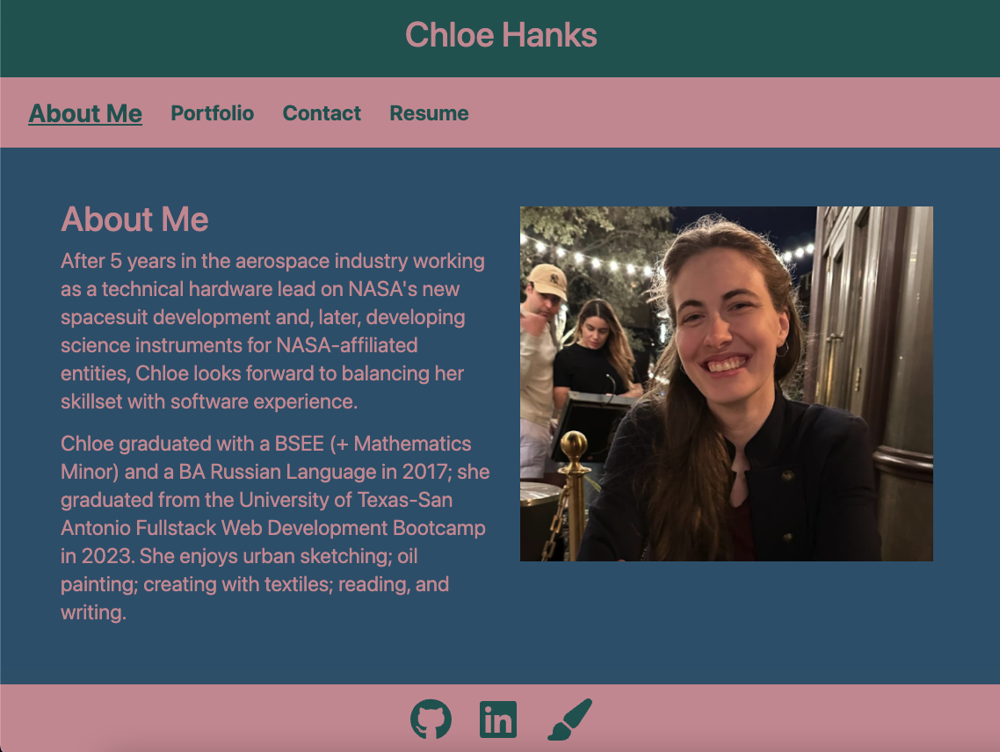
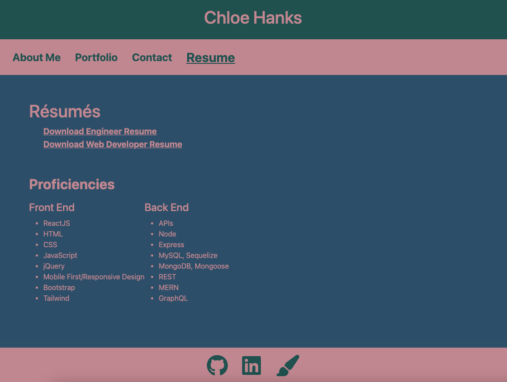

# wk2 - Create Portfolio

## Description
The purpose of this project is to create a new and improved portfolio using React. viewport-responsive webpage that displays the author's portfolio. When the user clicks on any of the navigation links in the header, the webpage will bring the user to the selected section. 

> **Note 1** View the document entitled README.md in the [github repository ](https://github.com/chloeeh/hanks-react-portfolio/tree/main) for instructions on how to see my portfolio. The project _Acceptance Criteria_ and screenshots of the webpage in different sizes (to show it is a responsive design) are depicted below:


## Acceptance Criteria

```md
GIVEN a single-page application portfolio for a web developer
WHEN I load the portfolio
THEN I am presented with a page containing a header, a section for content, and a footer
WHEN I view the header
THEN I am presented with the developer's name and navigation with titles corresponding to different sections of the portfolio
WHEN I view the navigation titles
THEN I am presented with the titles About Me, Portfolio, Contact, and Resume, and the title corresponding to the current section is highlighted
WHEN I click on a navigation title
THEN I am presented with the corresponding section below the navigation without the page reloading and that title is highlighted
WHEN I load the portfolio the first time
THEN the About Me title and section are selected by default
WHEN I am presented with the About Me section
THEN I see a recent photo or avatar of the developer and a short bio about them
WHEN I am presented with the Portfolio section
THEN I see titled images of six of the developer’s applications with links to both the deployed applications and the corresponding GitHub repositories
WHEN I am presented with the Contact section
THEN I see a contact form with fields for a name, an email address, and a message
WHEN I move my cursor out of one of the form fields without entering text
THEN I receive a notification that this field is required
WHEN I enter text into the email address field
THEN I receive a notification if I have entered an invalid email address
WHEN I am presented with the Resume section
THEN I see a link to a downloadable resume and a list of the developer’s proficiencies
WHEN I view the footer
THEN I am presented with text or icon links to the developer’s GitHub and LinkedIn profiles, and their profile on a third platform (Stack Overflow, Twitter)
```








## Installation

Please view the document entitled README.md in the [github repository ](https://github.com/chloeeh/hanks-react-portfolio/tree/main)

This was deployed using GitHub Pages

## Usage

Open the webpage using the [live URL link](https://chloeeh.github.io/hanks-react-portfolio/) and use Chrome Developer Tools to inspect the source code. The code is commented and includes accessibility tags compared to the original code that used generic division tags.


## Credits

Resources used:
1) Bootcamp 20-React Activities
2) [Font Awesome Free Brands](https://www.npmjs.com/package/@fortawesome/free-brands-svg-icons)
3) [More Font Awesome](https://fontawesome.com/v6/docs/web/use-with/react/)
4) [Deploy to GH Pages](https://create-react-app.dev/docs/deployment/#github-pages)
5) [How To Deploy A React App To Github Pages (Simple)](https://www.youtube.com/watch?v=Q9n2mLqXFpU)
6) [Display favicon in document title](https://stackoverflow.com/questions/18156240/use-font-awesome-icon-as-favicon)
7) [Convert Font Awesome icon into favicon](https://gauger.io/fonticon/)

## License

Please refer to the LICENSE in the repository.